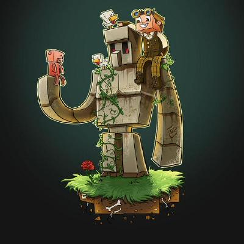

Hey there! I'm Samuel Davis.

I'm always on the lookout for the latest model architectures and love diving into what brilliant minds are coming up with. Learning and exploring new ideas keeps me excited and inspired.
## Contact Details

Phone No - +91 8652289114

Email - samuel.davis.aiml@gmail.com

GitHub - [sam99dave](https://github.com/sam99dave)

# Experience

## Quantiphi

Title - Sr. Machine Learning Engineer

Location - Mumbai

### Internal Product Development ( QDox )

- Integrated and experimented extensively with OCR solutions.
- Conducted R&D, trained, and evaluated QA models (DeBERTav3, Donut); containerized scripts for seamless model onboarding.
- Led a POC for SQL query generation/execution using Flan-T5, LangChain SQL agents, and AWS RDS.
- Created and analyzed topic modeling solutions with LDA (gensim) and BERTopic; containerized and deployed via AWS Lambda.
- Built an Active Learning solution to enhance data labeling and boost model performance.
- Contributed to an anonymization solution available on AWS Marketplace
- Led the R&D for document text anonymization using opensource solutions, displaying promising results.
- Contributed in the development and deployment RAG system using LLMs, LangChain retriever, agents, and vector stores (OpenSearch).

### Kiddom

- **Team Leadership**: Led a team of taggers for data annotation and played a key role in planning the end-to-end solution architecture.
- **Model Development**: Explored transformer-based Donut model; trained and developed custom pre-processing and post-processing for nested hierarchy retrieval.
- **Database Management**: Utilized DynamoDB and RDS for necessary database updates.
- **API Analysis**: Led the exploration and analysis of Textract Layout API for layout extraction.

### Proof of Concepts

- Trained/deployed models for information extraction for specific client data.
- Undertook the development of solutions for enhancing and aligning layout to retain simple & complex transcript structure.
- End to end integration using SQS, AWS Lambda, SageMaker Endpoints and metadata storing using DynamoDB and RDS.

### Sports Analytics - Coach Solution Firm

- **Player Performance Tracking System (Production)** - Developed custom Player Tracking solution for sports use cases.
- Optimized scaled-YOLOv3 and custom SVHN classifier for jersey number recognition reducing latency by **3x**.
- Developed & trained a custom Action Recognition model using ResNet and LSTM on practice session data.
- Performed rigorous video analysis and developed dataset creation script. Performed hyperparameter tuning and performance evaluation.
- Undertook R&D for optimizing Action Recognition solution, trained and evaluated performance & latency using different CNN backbones such as DenseNet and CSPNet.

### Sports Media

- **Media archival system for DFL (Production)** - Developed an Object Tracking solution for players using YOLOv5 and SORT, customized the SORT algorithm to generate & utilize histograms to reduce ID Breaking issues.
- Performed rigorous video analysis and developed post-processing script to reduce ID Switching issues.
- Optimized GPU utlization for Face Detection & Recognition solution by batching and using FAISS, reducing the latency by 3x with improved throughput.
- Performed output Data analysis using elbow method and dendograms. Developed Clustering solution for overall performance enhancement & review process optimization.
- Developed scripts for video and frame metadata extraction using ffmpeg.
- Integrated ML modules with optimized GPU utilization reducing the turnaround time for the solution end 2 end by ~ 70%

## Quantiphi

Title - Machine Learning Engineer Intern

Location - Mumbai

### R&D

- Generated synthetic dataset using Unreal Engine & UnrealCV for Object Detection, Instance Segmentation & Object Tracking task.
- Developed custom data preparation scripts involving contour & thresholding using OpenCV.
- Trained & evaluated model performance for Detectron, YOLOv5, Syn-Transformer and FairMOT on various combination of real & synthetic data.

# Education

Bachelor of Engineering - Computer Engineering

# Certifications

>Nvidia Fundamentals of Accelerated Computing with CUDA
>
>AWS Certified Cloud Practitioner
>
>MLExpert Certificate Of Completion
>
>Deep Learning Specialization
>
>Machine Learning Course (Stanford)

# Personal Projects

